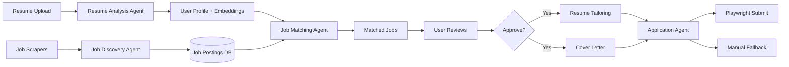

# CareerPilot AI

Personalized Multi-Agent Job Search & Application Platform

**Owner:** Subham | **Location:** Ahmedabad, India  
**Target Roles:** DevOps / Cloud / Infrastructure / SRE / Platform / IT Support  
**Running Cost:** ₹0/month (beyond existing VPS)

## Architecture

```
┌─────────────────────────────────────────────────┐
│                  Telegram Bot                     │
│     /status /jobs /approve /reject /stats        │
└──────────────────────┬──────────────────────────┘
                       │
┌──────────────────────▼──────────────────────────┐
│              FastAPI Backend                      │
│   ┌─────────┐ ┌──────────┐ ┌──────────────────┐ │
│   │ Auth    │ │ Resume   │ │ Job Discovery     │ │
│   │ (JWT)   │ │ Analysis │ │ (LinkedIn, Naukri,│ │
│   │         │ │ (Groq)   │ │  Indeed)          │ │
│   └─────────┘ └──────────┘ └──────────────────┘ │
│   ┌─────────┐ ┌──────────┐ ┌──────────────────┐ │
│   │ Job     │ │ Resume   │ │ Cover Letter      │ │
│   │Matching │ │Tailoring │ │ Generator         │ │
│   │(Groq)   │ │(Groq)    │ │ (Groq)           │ │
│   └─────────┘ └──────────┘ └──────────────────┘ │
│   ┌─────────┐ ┌──────────┐                      │
│   │Applica- │ │Playwright│                      │
│   │tion     │ │Auto-     │                      │
│   │Agent    │ │mation    │                      │
│   └─────────┘ └──────────┘                      │
└──────┬───────────────────────────────┬──────────┘
       │                               │
┌──────▼──────┐               ┌───────▼──────────┐
│  PostgreSQL  │               │      Redis        │
│  + pgvector  │               │  (Cache + Queue)  │
└──────────────┘               └──────────────────┘
       │                               │
┌──────▼───────────────────────────────▼──────────┐
│           Celery Workers + Beat Scheduler         │
│   Daily: Job Discovery (8AM) → Digest (9AM)     │
└─────────────────────────────────────────────────┘
```

## Tech Stack (100% Free)

| Component | Technology | Cost |
|-----------|-----------|------|
| LLM | Groq (Llama 3.3 70B) + Gemini Flash fallback | Free |
| Embeddings | sentence-transformers (all-MiniLM-L6-v2) | Free |
| Database | PostgreSQL 15 + pgvector | Free |
| Cache/Queue | Redis 7 + Celery | Free |
| Backend | FastAPI (Python 3.11+) | Free |
| Frontend | Next.js 14 + Tailwind CSS + shadcn/ui | Free |
| Browser | Playwright (headless Chromium) | Free |
| Proxy | Caddy (auto HTTPS via Let's Encrypt) | Free |
| Notifications | Telegram Bot API | Free |
| Hosting | Your existing VPS | ₹0 extra |
| **Total** | | **₹0/month** |

## Quick Start

```bash
# 1. Clone and configure
cd careerpilot
cp .env.example .env
# Edit .env with your API keys (Groq, Gemini, Telegram)

# 2. Deploy with Docker
docker compose up -d

# 3. Run database migrations
docker compose exec backend alembic upgrade head

# 4. Check health
curl https://careerpilot.yourdomain.com/health
```

## API Keys Needed (all free, no credit card)

| Service | Sign Up | Purpose |
|---------|---------|---------|
| Groq | https://console.groq.com | Primary LLM (14,400 req/day free) |
| Google AI Studio | https://aistudio.google.com | Fallback LLM (1,500 req/day free) |
| Telegram Bot | @BotFather on Telegram | Bot token for notifications |

## Pipeline



## Directory Structure

```
careerpilot/
├── backend/
│   ├── app/
│   │   ├── agents/       # 6 AI agents
│   │   ├── main.py        # FastAPI entry
│   │   ├── models.py      # SQLAlchemy ORM
│   │   ├── auth.py        # JWT + 2FA
│   │   ├── bot.py         # Telegram bot
│   │   ├── llm_client.py  # Groq/Gemini abstraction
│   │   └── agencies.py    # Database layer
│   ├── alembic/           # DB migrations
│   ├── requirements.txt
│   └── Dockerfile
├── frontend/
│   ├── src/
│   │   ├── app/           # Next.js pages
│   │   ├── components/    # UI components
│   │   ├── lib/           # API client + stores
│   │   └── types/         # TypeScript types
│   └── Dockerfile
├── docker-compose.yml
├── Caddyfile
├── .env.example
└── README.md
```

## License

MIT
